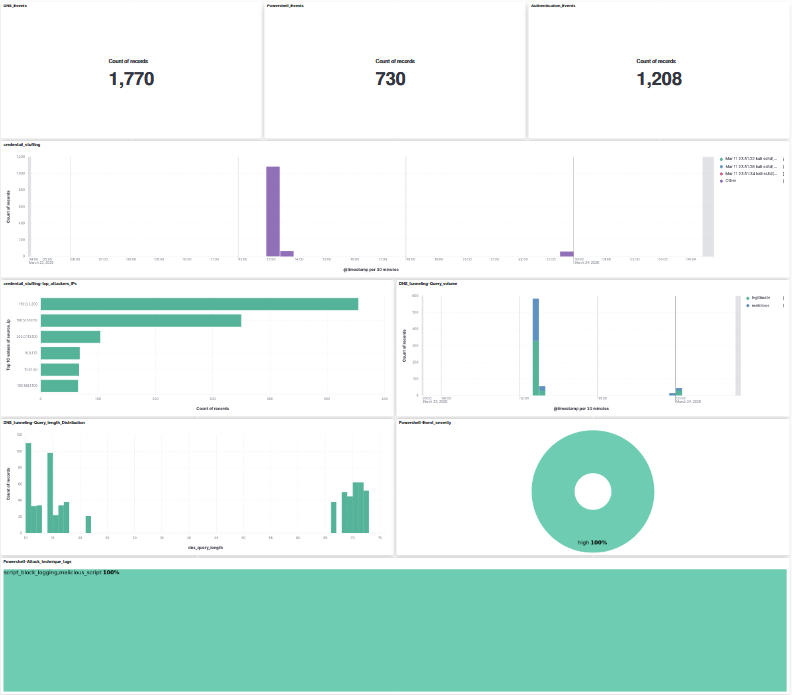
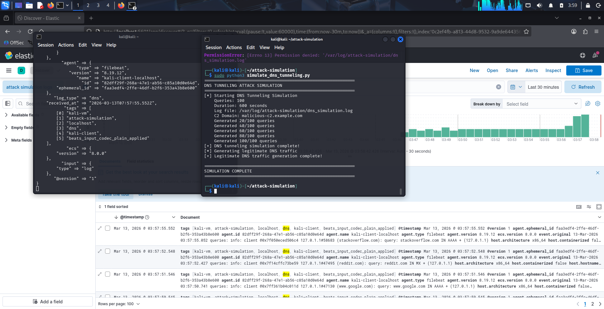
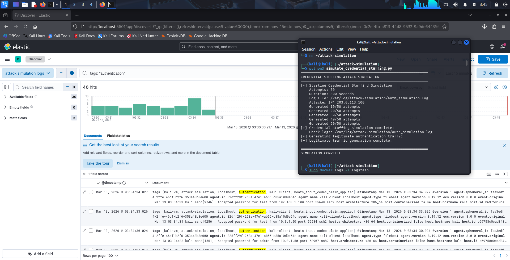

# ELK Stack SIEM Lab — Attack Simulation & Custom Dashboard

🚨 Simulated real-world attacks (Credential Stuffing, DNS Tunneling, PowerShell Exploitation)  
📊 Built custom dashboards to visualize attack patterns  
⚙️ Designed full SIEM pipeline using ELK Stack (Docker + Filebeat + Logstash)  

A hands-on cybersecurity lab demonstrating the deployment of an ELK Stack 
(Elasticsearch, Logstash, Kibana) SIEM, simulation of three real-world 
cyberattacks, and a custom Kibana dashboard for security event visualization.

---

## 🗂️ Lab Overview

| Component | Details |
|-----------|---------|
| Platform | ELK Stack 8.11.0 |
| Environment | Kali Linux + Docker Compose |
| Log Shipper | Filebeat |
| Attack Simulations | Credential Stuffing, DNS Tunneling, PowerShell Exploitation |
| Dashboard Panels | 7 visualizations + 6 Markdown documentation panels |
| Export | PDF via Kibana Reporting |

---

## 📁 Repository Structure
```
elk-siem-lab/
├── docker-compose.yml          # ELK stack deployment config
├── filebeat/
│   └── filebeat.yml            # Filebeat input & output config
├── attack-simulations/
│   ├── credential_stuffing.py  # SSH brute force simulation
│   ├── dns_tunneling.py        # DNS C2 tunnel simulation
│   └── powershell_exploitation.py  # PowerShell attack simulation
├── kibana/
│   └── dashboard-export.ndjson # Kibana saved objects export
└── reports/
    ├── ELK_Lab_Report.docx          # Part 1 lab report
    └── SIEM_Dashboard_Report.docx   # Part 2 dashboard report
```

📄 Detailed setup, troubleshooting, and analysis:
👉 
👉 

---

## 🏗️ Architecture
```
Python Scripts → Log Files → Filebeat → Logstash:5044 
    → Elasticsearch:9200 → Kibana:5601
```

All components run on a single Kali Linux VM. The ELK stack runs in 
Docker containers; Filebeat runs directly on the VM host to access 
local log files.

---

---

## 🎥 Demo

### 📊 Dashboard View


### 🚨 DNS Attack Logs


### Credential Stuffing Detection



---

## 🚀 Setup & Deployment

### Prerequisites
- Kali Linux (or any Debian-based Linux)
- Docker + Docker Compose installed
- Filebeat 8.11.0 installed on the host

---

## 💡 Why This Project Matters

Modern SOC teams rely on SIEM systems to detect and respond to threats.

This project demonstrates:
- How attacks generate logs
- How logs are processed and structured
- How analysts detect malicious behavior using SIEM tools

---

### 1. Start the ELK Stack
```bash
cd ELK-Lab
docker-compose up -d
```

Wait ~60 seconds, then verify:
```bash
curl http://localhost:9200/_cluster/health?pretty
```

Expected: `"status": "yellow"` or `"green"`

### 2. Configure Filebeat

Copy `filebeat/filebeat.yml` to your Filebeat config directory:
```bash
sudo cp filebeat/filebeat.yml /etc/filebeat/filebeat.yml
```

Create the log directory and start Filebeat:
```bash
sudo mkdir -p /var/log/attack-simulation
sudo systemctl enable filebeat
sudo systemctl start filebeat
```

### 3. Run Attack Simulations
```bash
# Run all three simulations
sudo python3 attack-simulations/credential_stuffing.py
sudo python3 attack-simulations/dns_tunneling.py
sudo python3 attack-simulations/powershell_exploitation.py
```

### 4. Access Kibana

Open `http://localhost:5601` in your browser.

Import the dashboard:
**Stack Management → Saved Objects → Import → select `kibana/dashboard-export.ndjson`**

---

## 🎯 Attack Simulations

### 1. Credential Stuffing (`credential_stuffing.py`)
Simulates an SSH brute-force/credential stuffing attack generating 
syslog-format authentication log entries.

- **50 attack attempts** at 95% failure rate from spoofed attacker IPs
- **10 legitimate login events** as baseline noise
- Log format: syslog SSH (`Failed/Accepted password for <user> from <ip>`)
- Output: `/var/log/attack-simulation/auth_simulation.log`

**Detection signals:** High failed login volume from a single IP, 
multiple usernames attempted from same source.

---

### 2. DNS Tunneling (`dns_tunneling.py`)
Simulates DNS-based C2 communication by generating BIND-style DNS 
query logs with encoded subdomain payloads.

- **100 tunneling queries** with hex/base64-encoded subdomains (60–90 chars)
- **30 legitimate queries** to common domains as baseline
- C2 domain: `malicious-c2.example.com`
- Log format: BIND DNS query log
- Output: `/var/log/attack-simulation/dns_simulation.log`

**Detection signals:** Abnormally long query names, high query 
frequency to a single domain, base64/hex patterns in subdomains.

---

### 3. PowerShell Exploitation (`powershell_exploitation.py`)
Simulates Windows PowerShell-based attack techniques generating 
Sysmon-style Event ID 1 (Process Create) and Event ID 4104 
(Script Block Logging) entries.

- **20 malicious events** covering 8 attack techniques
- **10 legitimate PowerShell events** as baseline
- Techniques: encoded commands, AMSI bypass, Mimikatz, 
  Defender exclusion, lateral movement
- 60% spawned from suspicious parent processes (WINWORD.EXE etc.)
- Output: `/var/log/attack-simulation/powershell_simulation.log`

**Detection signals:** Office apps spawning PowerShell, 
`-encodedCommand`/`-ExecutionPolicy Bypass` flags, 
`Invoke-Mimikatz`/`DownloadString` in command lines.

---

---

## 🧠 Detection Strategy

Instead of relying on pre-built rules, this lab focuses on:

- Log enrichment using Logstash
- Creating structured fields for analysis
- Identifying anomalies through visualization

This approach simulates how analysts manually investigate threats in early-stage SOC environments.

---

## 📊 SIEM Dashboard

The Kibana dashboard consists of 7 visualization panels and 6 
Markdown documentation panels organized into three attack-category sections.

### Visualizations

| Panel | Type | Attack Category |
|-------|------|-----------------|
| Event Volume KPIs (×3) | Metric | All |
| Failed Login Timeline | Bar (vertical) | Credential Stuffing |
| Top Attacker IPs | Bar (horizontal) | Credential Stuffing |
| DNS Query Volume | Line (dual layer) | DNS Tunneling |
| DNS Query Length Distribution | Bar (vertical) | DNS Tunneling |
| PowerShell Severity Breakdown | Donut | PowerShell Exploitation |
| PowerShell Attack Technique Tags | Treemap | PowerShell Exploitation |

### Runtime Fields

Three Painless runtime fields were created in Kibana to extract 
structured attributes from raw log messages:

- **`source_ip`** — extracts attacker IP from syslog auth messages
- **`dns_query_length`** — measures encoded subdomain query length
- **`ps_severity`** / **`ps_tags`** — extracts severity and technique 
  tags from Sysmon-style log entries

---

## 🔧 Troubleshooting

**Kibana alerting blocked — "encryption key required"**  
Add to `docker-compose.yml` under Kibana environment:
```yaml
- xpack.encryptedSavedObjects.encryptionKey=<32-char-hex>
- xpack.alerting.encryptionKey=<32-char-hex>
- xpack.reporting.encryptionKey=<32-char-hex>
```

**Dashboard lost after `docker-compose down`**  
Ensure named volumes are configured in `docker-compose.yml`:
```yaml
volumes:
  esdata:
    driver: local
  kibanaData:
    driver: local
```

**Filebeat not shipping logs**  
```bash
sudo systemctl status filebeat
sudo journalctl -u filebeat -f
```

---

## 📄 Reports

Detailed lab reports are included in the `/reports` directory:

- **ELK_Lab_Report.docx** — covers environment setup, 
  Filebeat configuration, and attack simulation design
- **SIEM_Dashboard_Report.docx** — covers dashboard design, 
  all visualization implementations, and troubleshooting encountered

---

## 🛠️ Tech Stack

- **Elasticsearch 8.11.0** — log indexing and search
- **Logstash 8.11.0** — log ingestion pipeline  
- **Kibana 8.11.0** — visualization and dashboard
- **Filebeat 8.11.0** — log shipping agent
- **Docker Compose** — container orchestration
- **Python 3** — attack simulation scripts
- **Kali Linux** — lab environment

---

## ⚠️ Disclaimer

All attack simulations in this repository are for **educational purposes 
only**. No real systems were targeted. Attacker IP addresses used are from 
[RFC 5737](https://tools.ietf.org/html/rfc5737) TEST-NET ranges 
(203.0.113.0/24, 198.51.100.0/24, 192.0.2.0/24) which are non-routable 
and reserved for documentation.

---

## 👤 Author

**Pranmoy Patar**  
Personal portfolio project — ELK Stack SIEM Lab